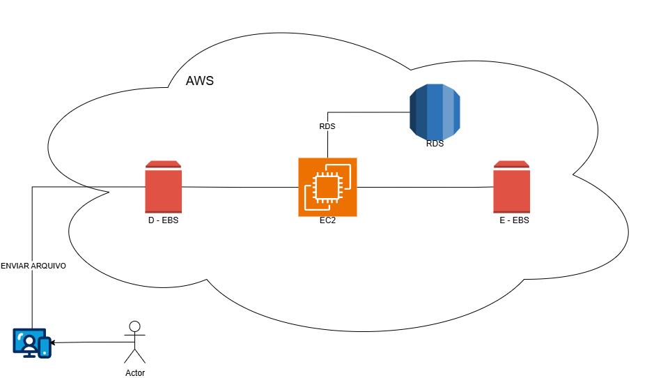

# Desafio de Projeto:  Proposta de Arquitetura de Nuvem na AWS

  
  
  

Este repositório documenta a solução para o Desafio de Projeto do bootcamp **Santander Code Girls 2025**, focado em conceitos de Cloud Computing com a AWS. O objetivo é apresentar uma solução de arquitetura de nuvem utilizando os principais serviços da Amazon Web Services (AWS), conforme solicitado na primeira parte do desafio.

---
## 1. Arquitetura da Solução Proposta

A arquitetura desenhada representa uma aplicação web simples e robusta na nuvem da AWS, onde um usuário interage com uma infraestrutura escalável e segura para enviar e processar arquivos.

### Diagrama

### Descrição dos Componentes

* **Actor (Usuário)**: Representa o cliente final que interage com a aplicação, iniciando o fluxo com o envio de um arquivo.
* **EC2 (Elastic Compute Cloud)**: É o servidor virtual central da nossa aplicação. Ele é responsável por receber as requisições, processar os arquivos enviados e executar a lógica de negócio principal.
* **EBS (Elastic Block Store)**: São os volumes de armazenamento (discos rígidos virtuais) conectados à instância EC2. A arquitetura sugere o uso de múltiplos volumes para uma melhor organização e gerenciamento de dados, como um para o sistema operacional e outros para os dados da aplicação.
A arquitetura utiliza dois volumes:
    * **Volume D-EBS**: Poderia ser utilizado para armazenar os dados brutos ou arquivos da aplicação, separado do sistema operacional para facilitar backups e gerenciamento.
    * **Volume E-EBS**: Poderia funcionar como um volume de backup, para logs ou para dados processados, garantindo maior organização e segurança.
* **RDS (Relational Database Service)**: É o serviço de banco de dados gerenciado da AWS. Ele armazena informações estruturadas, como metadados dos arquivos, perfis de usuário ou logs de transações, de forma segura e escalável, sem a necessidade de gerenciar o servidor de banco de dados manualmente.

### Fluxo da Aplicação

1.  O **Usuário** envia um arquivo para a aplicação.
2.  A instância **EC2** recebe este arquivo.
3.  A lógica da aplicação na **EC2** processa o arquivo e armazena os dados nos volumes **EBS** anexados.
4.  As informações e metadados relevantes sobre o arquivo ou a operação são gravados no banco de dados **RDS** para consulta posterior.